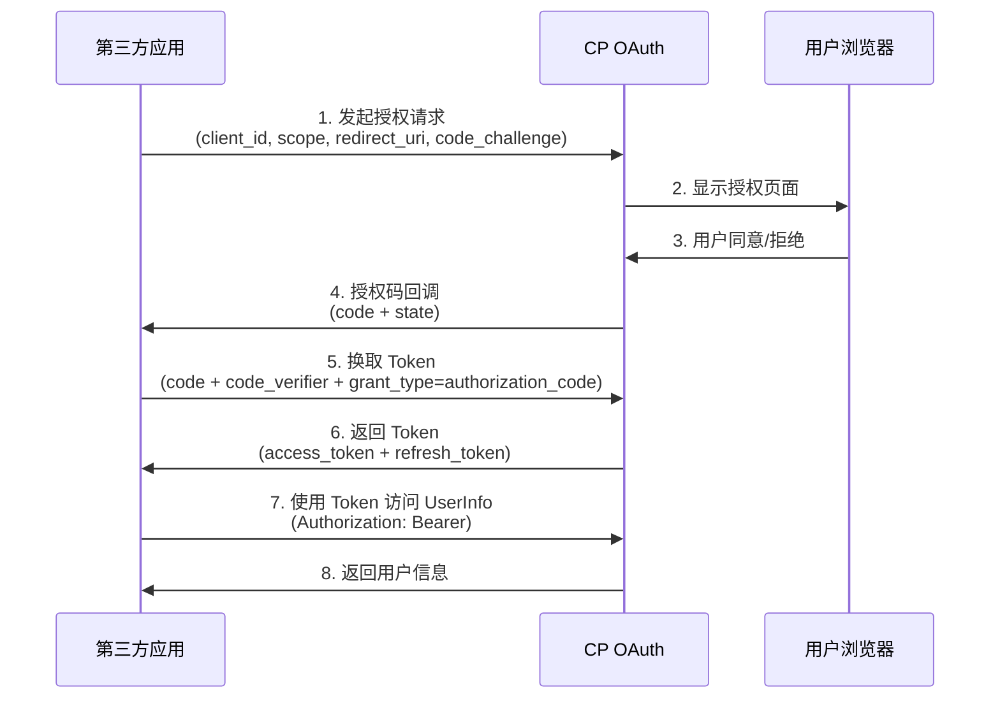

# Authorization Code + PKCE 流程

```mermaid
sequenceDiagram
    participant App as 第三方应用
    participant OAuth as CP OAuth
    participant Browser as 用户浏览器

    App->>OAuth: 1. 发起授权请求<br/>(client_id, scope, redirect_uri, code_challenge)
    OAuth->>Browser: 2. 显示授权页面
    Browser->>OAuth: 3. 用户同意/拒绝
    OAuth->>App: 4. 授权码回调<br/>(code + state)
    App->>OAuth: 5. 换取 Token<br/>(code + code_verifier + grant_type=authorization_code)
    OAuth->>App: 6. 返回 Token<br/>(access_token + refresh_token)
    App->>OAuth: 7. 使用 Token 访问 UserInfo<br/>(Authorization: Bearer)
    OAuth->>App: 8. 返回用户信息
```
