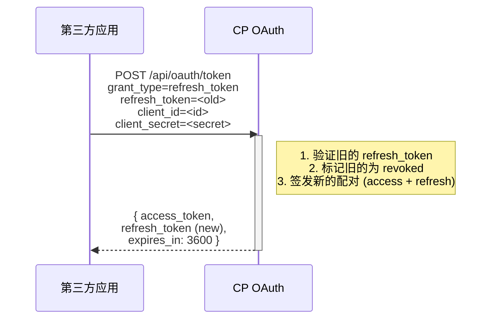

# Token 刷新（Refresh Token Rotation）

```mermaid
sequenceDiagram
    participant App as 第三方应用
    participant OAuth as CP OAuth

    App->>OAuth: POST /api/oauth/token<br>grant_type=refresh_token<br>refresh_token=<old><br>client_id=<id><br>client_secret=<secret>
    activate OAuth
    Note right of OAuth: 1. 验证旧的 refresh_token<br>2. 标记旧的为 revoked<br>3. 签发新的配对 (access + refresh)
    OAuth-->>App: { access_token,<br>refresh_token (new),<br>expires_in: 3600 }
    deactivate OAuth
```