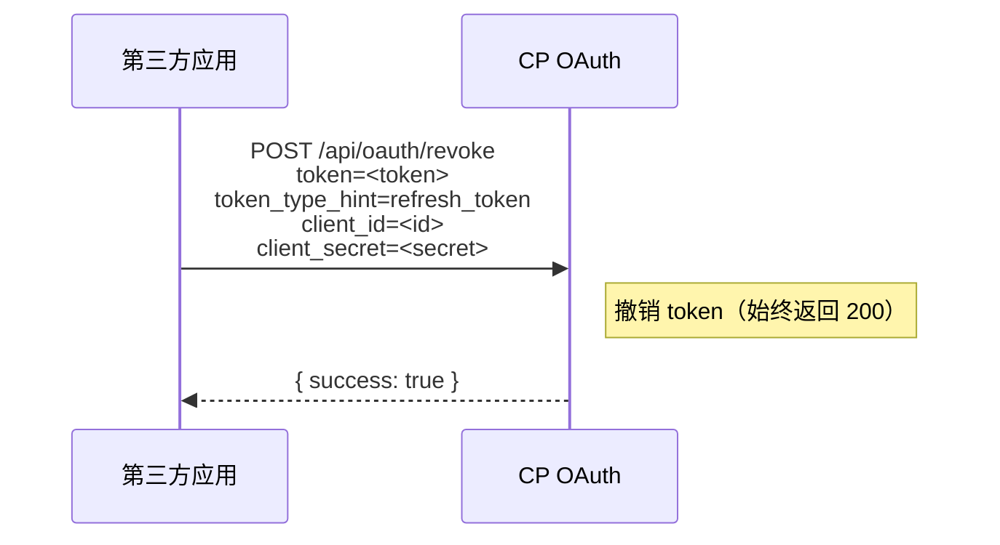

# Token 撤销（RFC 7009）

```mermaid
sequenceDiagram
    participant App as 第三方应用
    participant OAuth as CP OAuth

    App->>OAuth: POST /api/oauth/revoke<br>token=<token><br>token_type_hint=refresh_token<br>client_id=<id><br>client_secret=<secret>
    Note right of OAuth: 撤销 token（始终返回 200）
    OAuth-->>App: { success: true }
```